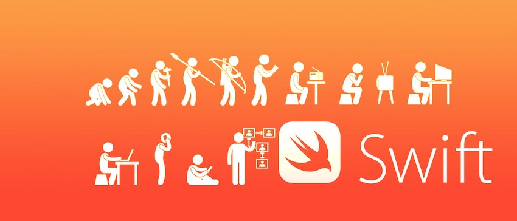

# Swift-Language

Code and learn fast 👨‍💻

## Fundamentals 🔐

* Optional Chaining ([code here](https://github.com/rmznaev/Swift-Language/blob/master/Swift_Advanced.playground/Pages/Optional%20Chaining.xcplaygroundpage/Contents.swift))
* Guard & Defer Statements ([code here](https://github.com/rmznaev/Swift-Language/blob/master/Swift_Advanced.playground/Pages/Guard%20%26%20Defer%20Statements.xcplaygroundpage/Contents.swift))
* Error Handling ([code here](https://github.com/rmznaev/Swift-Language/blob/master/Swift_Advanced.playground/Pages/Error%20Handling.xcplaygroundpage/Contents.swift))
* Type Casting ([code here](https://github.com/rmznaev/Swift-Language/blob/master/Swift_Advanced.playground/Pages/Type%20Casting.xcplaygroundpage/Contents.swift))
* Generics ([code here](https://github.com/rmznaev/Swift-Language/blob/master/Swift_Advanced.playground/Pages/Generics.xcplaygroundpage/Contents.swift))
* Subscripts ([code here](https://github.com/rmznaev/Swift-Language/blob/master/Swift_Advanced.playground/Pages/Subscripts.xcplaygroundpage/Contents.swift))
* Class & Struct ([code here](https://github.com/rmznaev/Swift-Language/blob/master/Swift_Advanced.playground/Pages/Class%20vs%20Struct.xcplaygroundpage/Contents.swift))
* Set & Tuple ([code here](https://github.com/rmznaev/Swift-Language/blob/master/Swift_Advanced.playground/Pages/Set%20%26%20Tuple.xcplaygroundpage/Contents.swift))
* Extension ([code here](https://github.com/rmznaev/Swift-Language/blob/master/Swift_Advanced.playground/Pages/Extension.xcplaygroundpage/Contents.swift))
* Operators ([code here](https://github.com/rmznaev/Swift-Language/blob/master/Swift_Advanced.playground/Pages/Operators.xcplaygroundpage/Contents.swift))
* Typealias ([code here](https://github.com/rmznaev/Swift-Language/blob/master/Swift_Advanced.playground/Pages/Typealias.xcplaygroundpage/Contents.swift))

## Object Oriented Programming (OOP) 🛠

* Convenience Init ([code here](https://github.com/rmznaev/Swift-Language/blob/master/Swift_Advanced.playground/Pages/Convenience%20Init%20(OOP).xcplaygroundpage/Contents.swift))
* Computed Property ([code here](https://github.com/rmznaev/Swift-Language/blob/master/Swift_Advanced.playground/Pages/Computed%20Property%20(OOP).xcplaygroundpage/Contents.swift))
* Property Observer ([code here](https://github.com/rmznaev/Swift-Language/blob/master/Swift_Advanced.playground/Pages/Property%20Observer%20(OOP).xcplaygroundpage/Contents.swift))
* Failable Init ([code here](https://github.com/rmznaev/Swift-Language/blob/master/Swift_Advanced.playground/Pages/Failable%20Int.xcplaygroundpage/Contents.swift))
* Override Method ([code here](https://github.com/rmznaev/Swift-Language/blob/master/Swift_Advanced.playground/Pages/Override%20Method%20(OOP).xcplaygroundpage/Contents.swift))
* Two Phase Init ([code here](https://github.com/rmznaev/Swift-Language/blob/master/Swift_Advanced.playground/Pages/Two%20Phase%20Init%20(OOP).xcplaygroundpage/Contents.swift))
* Type Property & Method ([code here](https://github.com/rmznaev/Swift-Language/blob/master/Swift_Advanced.playground/Pages/Type%20Property%20%26%20Method%20(OOP).xcplaygroundpage/Contents.swift))
* Singleton Pattern ([code here](https://github.com/rmznaev/Swift-Language/blob/master/Swift_Advanced.playground/Pages/Singleton%20Pattern%20(OOP).xcplaygroundpage/Contents.swift))

## Functional Swift ⚙️

* Intro to Closures Part I ([code here](https://github.com/rmznaev/Swift-Language/blob/master/Swift_Advanced.playground/Pages/Intro%20to%20Closures%20Part%20I.xcplaygroundpage/Contents.swift))
* Intro to Closures Part II ([code here](https://github.com/rmznaev/Swift-Language/blob/master/Swift_Advanced.playground/Pages/Intro%20to%20Closures%20Part%20II.xcplaygroundpage/Contents.swift))
* Lazy Init with Closures ([code here](https://github.com/rmznaev/Swift-Language/blob/master/Swift_Advanced.playground/Pages/Lazy%20Init%20with%20Closures.xcplaygroundpage/Contents.swift))
* Capture Lists ([code here](https://github.com/rmznaev/Swift-Language/blob/master/Swift_Advanced.playground/Pages/Capture%20Lists.xcplaygroundpage/Contents.swift))
* Trailing Closures ([code here](https://github.com/rmznaev/Swift-Language/blob/master/Swift_Advanced.playground/Pages/Trailing%20Closures.xcplaygroundpage/Contents.swift))
* Completion Handlers ([code here](https://github.com/rmznaev/Swift-Language/blob/master/Swift_Advanced.playground/Pages/Completion%20Handlers.xcplaygroundpage/Contents.swift))
